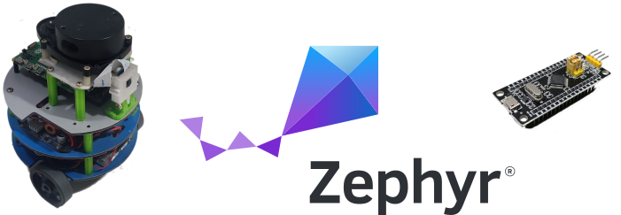

# Amanita Robot Controller Firmware using Zephyr RTOS

## Overview

This repository contains firmware for robot low level controller. It is capable to perform open-loop and closed-loop (PID) control of two DC brushed motors with rotary encoders. It is implemented using Zephyr RTOS and communicates with a host computer over USB.

Features:
- Controls two DC brushed motors with the H-Bridge driver.
- Supports PID control and raw PWM commands.
- Reads two rotary encoders using GPIO interrupts.
- Monitors battery power with the TI INA226.
- Communicates with a host computer using the Zephyr USB CDC-ACM driver.
- Uses a simple ASCII protocol for communication.

This code can be found under the Github repository: <https://github.com/branilson/amanita-controller>. It is is freely inspired on the ROS Arduino Bridge <https://github.com/hbrobotics/ros_arduino_bridge>.

## Dependencies

1. Zephyr 3.7: <https://github.com/zephyrproject-rtos/zephyr/tree/main>.
2. Pid-C library: Originally developed by Geoffrey Hunter, available at <https://github.com/gbmhunter/Pid-C>. This repository uses an slightly modified version available at <https://github.com/branilson/Pid-C>.

## Requirements

* Host computer whit USB interface. Preferentially, with Linux for a smoother experience.
* Serial terminal application. e.g. minicom, screen, tio, putty.
* 02 Brushed DC motor with quadrature encoder.
* 01 Dual H-bridge motor driver with PWM and two GPIO direction inputs. E.g. TB6612FNG, L298, etc.
* 01 TI INA225 power sensor module.
* In-circuit programmer like stlink or jlink.
* A high level application such as a ROS node or Python script.

## Building and Running

This firmware was developed and tested with the STM32 Minimal Development Board Black, also know as STM32F103C8T6 Back Pill. This application can be easily ported to other boards just creating a new overlay file, just mantaining the same peripheral aliases.

The flash memory of the Black Pill board was fully occupied. Actually, many peripherals set as default needed to be disabled to allow this to work in such a limited microcontroller. I had a lot of fun tweaking;) Anyway, everything worked fine!

### 1. Install Zephyr

Follow the guide on <https://docs.zephyrproject.org/latest/develop/getting_started/index.html>. Then, source the environment:

```bash
$ source ~/zephyrproject/zephyr/zephyr-env.sh
```

### 2. Download this repository and its dependencies in the folder of your preference.
```bash
$ git  clone git@github.com:branilson/amanita-controller.git
$ cd amanita-controller
```
### 3. Compile

```bash
$ west build -b stm32_min_dev@black --pristine
.
..
[7/7] Linking C executable zephyr/zephyr.elf
Memory region         Used Size  Region Size  %age Used
           FLASH:       64968 B        64 KB     99.13%
             RAM:       15152 B        20 KB     73.98%
        IDT_LIST:          0 GB        32 KB      0.00%
Generating files from /home/bl/dev/stm32/amanita-controller/build/zephyr/zephyr.elf for board: stm32_min_dev
```
Note: Replace stm32_min_dev@black by the name of your board. Needs a new overlay file added to boards folder.

### 4. Flash

```bash
$ west flash --runner jlink
-- west flash: using runner jlink
-- runners.jlink: reset after flashing requested
-- runners.jlink: JLink version: 7.94l
-- runners.jlink: Flashing file: /home/bl/dev/stm32/amanita-controller/build/zephyr/zephyr.hex
```
Note: Suppress the ```--runner jlink``` if you are using stlink instead.

### 5. Testing

Plug the board into a host device, for example, a PC running Linux.
The board will be detected as shown by the Linux dmesg command:

```bash
$ sudo dmesg
.
..
usb 1-2.1: New USB device strings: Mfr=1, Product=2, SerialNumber=3
usb 1-2.1: Product: amanita-controller
usb 1-2.1: Manufacturer: BL-LABS
usb 1-2.1: SerialNumber: 53497849066EFF56
cdc_acm 1-2.1:1.0: ttyACM1: USB ACM device
```
The app prints on serial output e.g. /dev/ttyACM1. Use a serial terminal to use the console:

```bash
$ minicom --device /dev/ttyACM1

*** Booting Zephyr OS build v3.7.0-3607-g0d118ec1abe0 ***

***  BL-Labs Amanita Controller running on stm32_min_dev ***

[00:00:01.002,000] <inf> cdc_acm_echo: Baudrate 115200

Enter a command and press enter or h <enter> for help.
```

The app should respond on serial output with the commands described in the help(h):
```
h
      h <enter> to print this help.
      b <enter> to get baudrate.
      e <enter> to get encoder counts/s.
      r <enter> to reset encoder counts.
      s <enter> to get motor speeds in ticks/s.
      g <enter> to get PID controller gains.
      d <enter> to toggle speed debug flag.
      p <enter> to get power(W), Voltage(V), and Current(A).
      m nn nn <enter> to set control speeds in ticks/s.
      o nn nn <enter> to set pwm speeds.
      u n.nn n.nn n.nn <enter> to update PID gains.
      nn is an integer number. n.nn is a float number.
e
e 0 0
o 500 500
o 500 500
u 0.021 0.09 0.0
```

## Troubleshooting

If the ModemManager runs on your operating system, it will try
to access the CDC ACM device and maybe you can see several characters
including "AT" on the terminal attached to the CDC ACM device.
You can add or extend the udev rule for your board to inform
ModemManager to skip the CDC ACM device.
For this example, it would look like this:

```
   ATTRS{idVendor}=="8086" ATTRS{idProduct}=="f8a1", ENV{ID_MM_DEVICE_IGNORE}="1"
```
You can use /lib/udev/rules.d/77-mm-usb-device-blacklist.rules`` as reference.

## Purpose of the Project

This software is not ready for production use. It has neither been developed nor
tested for a specific use case. However, the license conditions of the
applicable Open Source licenses allow you to adapt the software to your needs.
Before using it in a safety relevant setting, make sure that the software
fulfills your requirements and adjust it according to any applicable safety
standards, e.g., ISO 26262.

## License

This repository is open-sourced under the Apache-2.0 license. See the [LICENSE](LICENSE) file for details.

For a list of other open-source components included in ROS 2 system_modes,
see the file [3rd-party-licenses.txt](3rd-party-licenses.txt).

## Known Issues/Limitations

There are no known limitations.